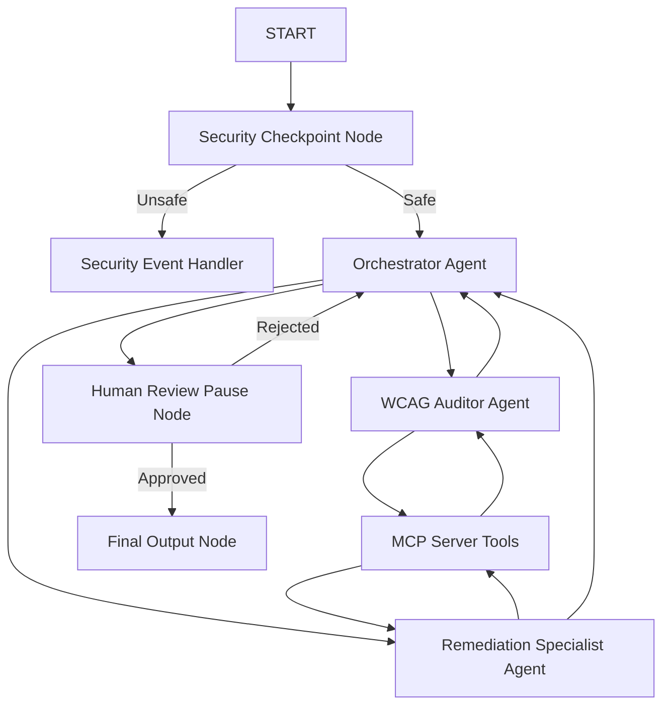

# Project Submission Writeup: Access-Helper

## Problem Statement
Making websites accessible to users with disabilities is legally mandated (WCAG 2.2 / ADA) and morally necessary. However, auditing web pages manually requires extensive expertise, and developers often skip or misinterpret guidelines. Automated CLI tools find basic issues but fail to suggest standard fixes, while static analysis cannot handle interactive states. 

**Access-Helper** solves this by offering an automated, secure, multi-agent AI workspace that audits code snippets, validates contrast, and proposes interactive, standards-compliant remediations that developers can approve in real time.

---

## Solution Architecture

---

## Concepts & ADK Features Used
* **ADK Workflow Graph**: Orchestrates the multi-turn flow of execution. Defined in [app/agent.py](file:///c:/Users/visha/OneDrive/Desktop/adk-workspace/access-helper/app/agent.py#L244-L253).
* **LlmAgent**: Used for specialized sub-agents (`wcag_auditor` and `remediation_specialist`) and the main `orchestrator` agent. Defined in [app/agent.py](file:///c:/Users/visha/OneDrive/Desktop/adk-workspace/access-helper/app/agent.py#L74-L116).
* **AgentTool**: Used by the `orchestrator` agent to delegate tasks to the sub-agents (`wcag_auditor` and `remediation_specialist`).
* **MCP Server**: Implements model context protocols to provide model-grounded tools. Defined in [app/mcp_server.py](file:///c:/Users/visha/OneDrive/Desktop/adk-workspace/access-helper/app/mcp_server.py).
* **Security Checkpoint**: Intercepts input before sending it to the agents to verify safety. Defined in [app/agent.py](file:///c:/Users/visha/OneDrive/Desktop/adk-workspace/access-helper/app/agent.py#L120-L177).
* **Agents CLI**: Used to scaffold the project structure, run testing suites, and manage environment parameters.

---

## Security Design
* **PII Redaction**: Intercepts emails and phone numbers to ensure sensitive data is not leaked to third-party model endpoints.
* **Prompt Injection Defense**: Scans input for common jailbreaks/instructions override patterns (`ignore instructions`, `override rules`, etc.) and immediately halts execution to prevent model manipulation.
* **Domain Content Length Gate**: Caps code input length at 10,000 characters to prevent system overloading and denial of service issues.

---

## MCP Server Design
The Model Context Protocol (MCP) server provides the agents with domain-grounded tools:
1. `search_wcag_guidelines`: Resolves keyword topics to official WCAG 2.2 rules to ground the auditor's assessments.
2. `validate_color_contrast`: Mathematically calculates color contrast ratios to verify compliance with AA and AAA standards.
3. `get_remediation_template`: Provides standard compliant code templates for quick remediation.

---

## Human-in-the-Loop (HITL) Flow
To prevent the agent from applying hallucinated or broken code suggestions, Access-Helper implements an interactive pause node `human_review` using `RequestInput`. It displays the proposed fixes to the developer and waits for an approval command (`Yes` / `No`). If approved, it finishes; if rejected, it feeds the user's feedback back into the orchestrator for correction.

---

## Demo Walkthrough
1. **Case 1: Focus Visibility Audit**: The user enters `<button style='outline: none;'>Click me</button>`. The agent detects a WCAG 2.4.7 violation, suggests a custom focus state CSS outline, pauses for review, and applies it upon receiving "Yes".
2. **Case 2: Injection Block**: An adversarial query is input. The security checkpoint catches it and responds with `⚠️ Security Access Denied: Prompt injection detected`.
3. **Case 3: Missing Alt Text**: The user audits ``. The agent flags the missing text description and suggests adding a descriptive `alt` attribute.

---

## Impact & Value Statement
Access-Helper bridges the gap between accessibility compliance and daily software development. It enables students, indie developers, and enterprise engineering teams to build fully inclusive websites securely and easily, avoiding costly legal liabilities and improving digital access for millions of users worldwide.
